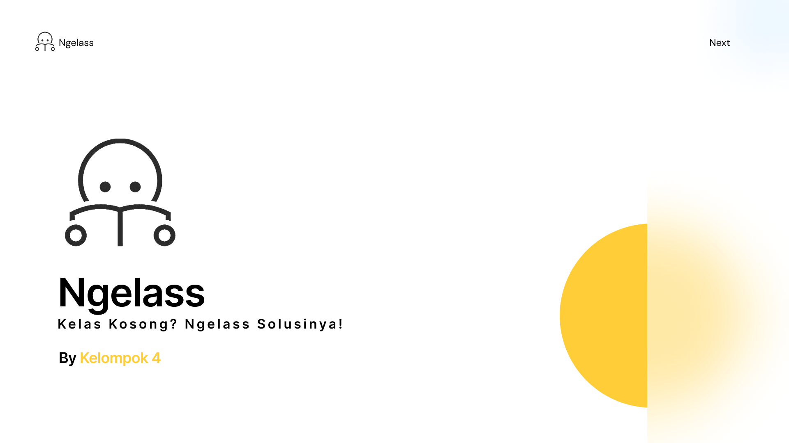

# Ngelass



**Ngelass** adalah aplikasi sederhana yang membantu mahasiswa memesan dan mengelola jadwal kelas di kampus. Aplikasi ini masih dalam tahap pengembangan client-side sebagai bagian dari tugas praktikum kuliah. Dengan antarmuka berbasis teks, pengguna dapat melakukan registrasi akun, login, melihat status kelas, melakukan booking, serta membatalkan reservasi dengan mudah.

## Fitur Utama
- **Register Akun**: Daftar akun baru untuk mengakses seluruh fitur Ngelass.
- **Login Akun**: Masuk ke akunmu untuk mengelola booking kelas.
- **Lihat Status Kelas**: Cek ketersediaan kelas secara real-time.
- **Booking Kelas**: Pesan kelas dengan mudah sesuai kebutuhanmu.
- **Batal Booking Kelas**: Fleksibel batalkan reservasi kelas kapan saja.

## Teknologi yang Digunakan
- **Bahasa Pemrograman**: C
- **Database**: Berbasis file (menggunakan file teks atau binary untuk menyimpan data)
- **Antarmuka Pengguna**: Text-based atau CLI (Command Line Interface)
- **File Handling**: Untuk menyimpan dan memanipulasi data akun, status kelas, dan booking
- **Data Structure**: Menggunakan array, struct, dan linked list untuk mengelola data

## Instalasi
1. Clone repository ini:
   ```bash
   git clone https://github.com/username/Ngelass.git
